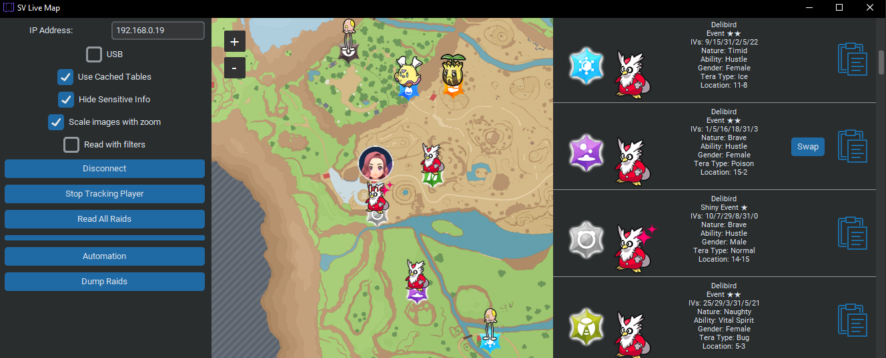
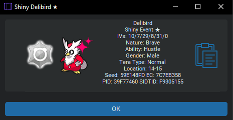

# sv-live-map

WIP GUI Map displaying information on Tera Raid Dens in Pokémon Scarlet and Violet

Spiritual sequel to [PLA-Live-Map](https://github.com/Lincoln-LM/PLA-Live-Map)

For a non-map GUI, check out [LegoFigure11](https://github.com/LegoFigure11)'s [RaidCrawler](https://github.com/LegoFigure11/RaidCrawler)

### Feature Requests/Pull Requests are welcome! Current problems/planned features are denoted with "TODO:" in code, or posted in the issues tab.

### Details:
sv-live-map reads tera raid encounter info directly from the flatbuffer binary in memory, this means that this repo does not need to contain serialized encounter information. 
This encounter info is then used to predict the generation of raid dens from their seeds and the player's current story progress, also stored in memory.
All relevant read/derived information is then displayed to the user via the graphical user interface.

The program also supports automatically date skipping until a target is found.

The main purpose of this project is to show off [elegant parsing of flatbuffer binaries in python](./sv_live_map_core/raid_enemy_table_array.py), documenting the structure of the binaries used in SV, test out [binary parsing with bytechomp](sv_live_map_core/raid_block.py), test out [modern-looking python gui with customtkinter](./main_gui), new features of python 3.11.0, as well as provide an alternative tool for reading raid data via sys-botbase.

### Powered by:
* [Python 3.11.0](https://www.python.org)
* [flatbuffers](https://github.com/google/flatbuffers) for the framework to read flatbuffer binaries
* [bytechomp](https://github.com/AndrewSpittlemeister/bytechomp) for non-flatbuffer binary parsing
* [CustomTkinter](https://github.com/TomSchimansky/CustomTkinter) and [TkinterMapView](https://github.com/TomSchimansky/TkinterMapView) for GUI
* [nxreader](https://github.com/Lincoln-LM/PyNXReader) (forked from [PyNXBot](https://github.com/wwwwwwzx/PyNXBot)) for switch connection and memory reading
* [sys-botbase](https://github.com/olliz0r/sys-botbase/) for the switch's side of the connection

### Credits:
* [Kaphotics/kwsch](https://github.com/kwsch) and the [PKHex](https://github.com/kwsch/PKHeX) dev contributors for their work on reverse-engineering and documentation
* [EzPzStreamz/SteveCookTU](https://github.com/SteveCookTU) for help with game resources and direct aid in reverse engineering
* [SkyLink98/Manu098vm](https://github.com/Manu098vm) for their early SV research along with documentation on memory pointers in [SVResearches](https://github.com/Manu098vm/SVResearches)
* [NPO-197](https://github.com/NPO-197) for help with player icon save blocks

### Image Credits:
* Icons in [icons8](./resources/icons8) folder provided by [icons8](https://icons8.com)
